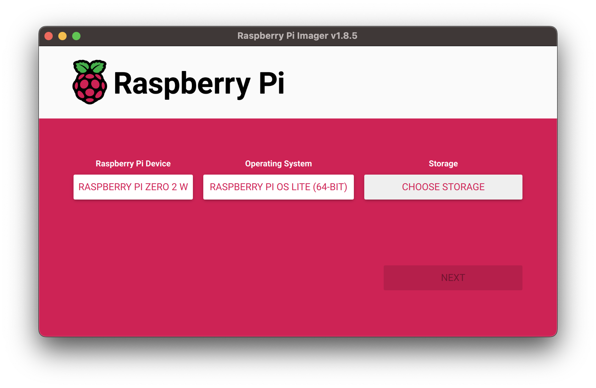

I’m diving into Rust and embedded development, both of which I’ve dipped in to before but never fully committed to. With my Raspberry Pi sitting around collecting dust, I figured it’s worth learning something new so I can put it to good use. I'll be using the [Raspberry Pi Zero 2W](https://www.raspberrypi.com/products/raspberry-pi-zero-2-w/) for this project, as it's a small and cheap device but more importantly, I have one lying around.

While the Zero 2 is a capable little machine, it’s not the most powerful device. Compiling Rust code directly on the Pi can be slow and frustrating, especially when you’re just starting out. It’s much more convenient to write and compile code on a more powerful machine, then deploy and run on the Pi.

I want to share my experience as a beginner in Rust and embedded development, and how I set up a practical development environment for making something for the Pi.

:::note
This is a very loose guide that I hope will help point others in the right direction, but it's _not_ a step-by-step tutorial. I'm assuming you have some basic knowledge of Rust and embedded development, and that you're comfortable with the command line.
:::

## Getting Ready

Before we can write a single line of code, we need to set up our hardware.

### Setting up the Hard(ware) Stuff

In my case, this means digging out the soldering iron and attaching some header pins to the Raspberry Pi Zero 2W. Header pins allow you to interact with other hardware peripherals and make interesting projects. It's a simple and fairly easy process, but it's just as easy to mess up if you're not careful (watching a video on [YouTube](https://www.youtube.com/watch?v=UDdbaMk39tM) should be enough to get you started).


### OS-ential Decisions

The next step was to install an operating system on the Pi. I went with [Raspberry Pi OS Lite](https://www.raspberrypi.com/software/operating-systems/#raspberry-pi-os-64-bit), which is a minimal version of the standard Raspberry Pi OS without the desktop environment. This is perfect for embedded development as it's lightweight and simple to get started[^1].

[^1]: Eventually I will probably explore more minimal operating systems or even build my own using something like [buildroot](https://buildroot.org/), but for now this is good enough and much quicker to get going than building our own linux system.

To install the OS, I used the [Raspberry Pi Imager](https://www.raspberrypi.com/software/), which is a simple tool that makes it easy to write images to a SD card.



Since I'm using the Lite version of the OS, I don't need to worry about setting up a desktop environment or anything like that. However, I did need to set up WiFi and SSH so that I can remote into my Pi to interact with it. Luckily, the Raspberry Pi Imager has a convenient settings menu to do this. If you are doing this, make sure that you have the correct image and card selected; the imager makes it easy enough to do this. Once that's done, you can insert the card into the Pi and power on you Pi.

:::tip
It might take a few seconds for the Pi to boot up, so be patient. You should see the green LED flashing as it boots up.
:::

You can now test everything is setup correctly by SSH-ing into the Pi using the hostname, username, and password. Something like this for the default settings:

```bash
ssh pi@raspberrypi.local
```

:::note
I'm using a Mac, so I can use the `.local` hostname to connect to the Pi. If you're using Windows, you might need to find the IP address of the Pi and connect using that.
:::

For convenience, I like to setup SSH keys so I don't have to type in the password every time I connect. You can do this by generating a key on your machine and copying the public key to the Pi. There are plenty of tutorials online that can help you with this.

## Now onto Rust

Now that we have the Pi setup, we can start setting up our development environment. Start a project with `cargo init --bin` You'll need to have Rust installed on your machine, but again, I won't go into that here as there are plenty of much better resources online to help you with that.

### Cross-ing Over

We are also going to need [cross](https://github.com/cross-rs/cross). It's a great tool that makes cross-compiling Rust code for different architectures very easy. It handles all the heavy lifting, so you don't have to worry about it. For now, we just need to install it with this command and do a little configuring; we'll use it later on.

```bash
cargo install cross --git https://github.com/cross-rs/cross
```

It acts as a drop in replacement for `cargo build` and `cargo run`, but it handles all the cross-compilation for you. You can specify the target architecture with the `--target` flag, but you can also specify a default in a `Cross.toml` file. For example if you're targeting Raspberry Pi OS Lite 64-bit, you can use something like this:

```toml
# filename: Cross.toml
[build]
# Use this target if none is explicitly provided
default-target = "aarch64-unknown-linux-gnu"
pre-build = [
  # Add any pre-build commands here
  # Like installing dependencies for any crates you're using
]
```

### Multiple Binaries in one Project

I set up my project to have multiple binaries, one for the Raspberry Pi and one for my local machine. This way I can run the code on my local machine before deploying it to the Pi. This is a simple setup that I found works well for me, but you can adjust it to suit your needs.

```
my_project/
├── Cargo.toml
├── Cargo.lock
├── Cross.toml
└── src/
    ├── bin/
    │   ├── local.rs        # Source file for the local binary
    │   └── raspberry_pi.rs # Source file for the Pi binary
    ├── lib.rs              # Shared library code
    └── ...                 # Other source files
```

You can specify the features for each binary in the `Cargo.toml` file. This way you can include or exclude dependencies based on the binary you're building. For example, you might have a dependency that's only needed for the Raspberry Pi binary, or a dependency that's only needed for the local binary. You can specify these dependencies in the `Cargo.toml` file like this:

```toml
# filename: Cargo.toml
[package]
name = "my_app"
# other keys omitted for brevity...

[dependencies]
a_common_dependency = "1.0"
a_dependency_for_just_the_pi = {version="1.0", optional=true}
a_dependency_for_just_local = {version="1.0", optional=true}

[features]
raspberry_pi = ["a_dependency_for_just_the_pi"] # Raspberry Pi features
local = ["a_dependency_for_just_local"]         # Local features

[[bin]]
# This is the main binary that runs on the raspberry pi
name = "raspberry_pi"
path = "src/bin/raspberry_pi.rs"
required-features = ["raspberry_pi"]

[[bin]]
# This is a binary that runs on your local machine
name = "local"
path = "src/bin/local.rs"
required-features = ["local"]
```

Features are useful because it lets me have code and dependencies that are shared between the two binaries, but specific to each binary. For example, I might have bits of code that are only needed on the Pi, or bits of code that are only needed on my local machine. I try and keep as much code shared as possible, and stick the specific bits in the `bin` files. But I can also do this sort of thing if I need to:

```rust
// Only include this module on the Raspberry Pi
#[cfg(feature = "raspberry_pi")]
pub mod a_raspberry_pi_only_module;
```

### Compile & Conquer

With this setup, I can build and run the local binary with `cargo run --bin local`. But what about the Raspberry Pi binary? This is where `cross` comes in. I can build and run the Raspberry Pi binary with `cross run --bin raspberry_pi`. Now what?

I _could_ copy the binary to the Pi and run it manually, but that's a bit of a pain. Instead, I can use `scp` and `ssh` to copy the binary to the Pi and run it automatically.

```bash
#!/bin/bash

# Cross compile the binary for the Raspberry Pi
cross build --bin raspberry_pi --features raspberry_pi
# Copy the binary to the Pi
scp target/aarch64-unknown-linux-gnu/debug/raspberry_pi pi@raspberrypi.local:/home/pi/app
# Run the binary on the Pi
ssh pi@raspberrypi.local "chmod +x /home/pi/app && /home/pi/app"
```

You can run these commands every time you want to run on the Pi, but I like to use [just](https://github.com/casey/just) to automate this process; you could use a Makefile, shell script or something similar to achieve the same thing.

## Closing Thoughts


This is a very basic setup that I've found works well for me. I'm still learning, so I'm sure there are more complex and better ways to do things. That being said this meets all my needs so far, and it was surprisingly easy to get everything set up despite just starting out.

Next I want to start playing around with hardware peripherals using [rppal](https://crates.io/crates/rppal). More specifically, an LCD display and the [embedded-graphics](https://crates.io/crates/embedded-graphics) crate[^2].

[^2]: The Zero 2W only supports OpenGL ES 2.0 and a lot of great Rust graphics crates rely on [wgpu](https://github.com/gfx-rs/wgpu) which doesn't support 2.0, so it might be easier to use CPU driven graphics to start with. But maybe I'll try and get OpenGL working at some point, who knows.

If you have any suggestions or improvements, I'd love to hear them! Stay tuned for more posts as I continue stumbling through Rust and embedded development.
