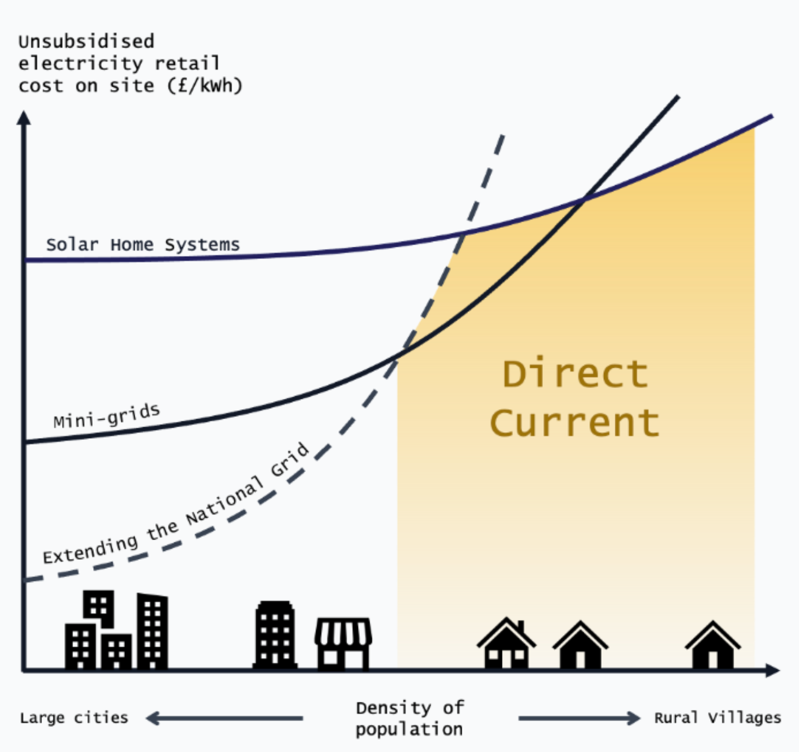
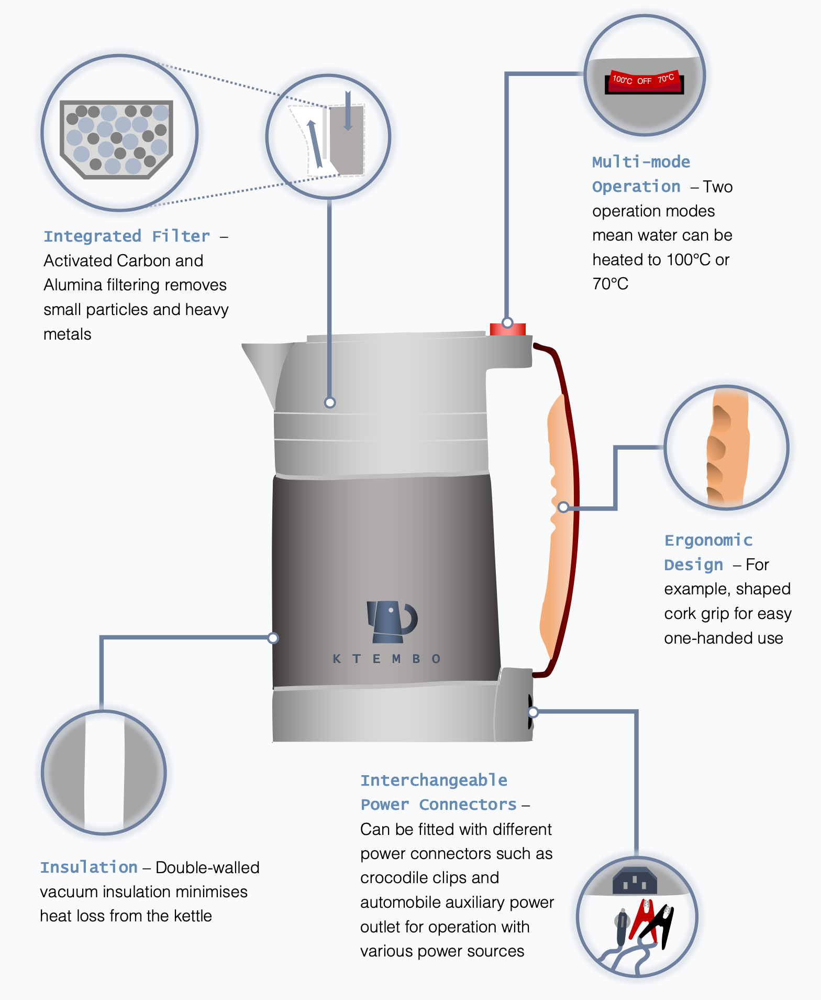
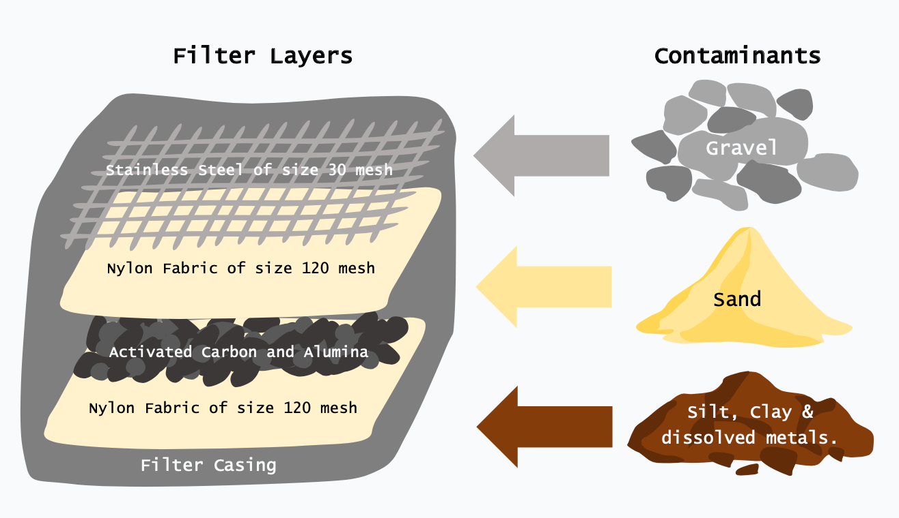
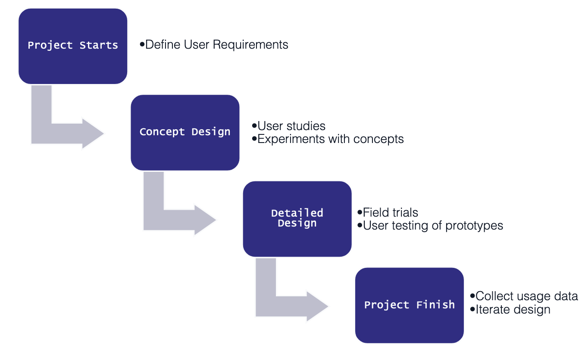
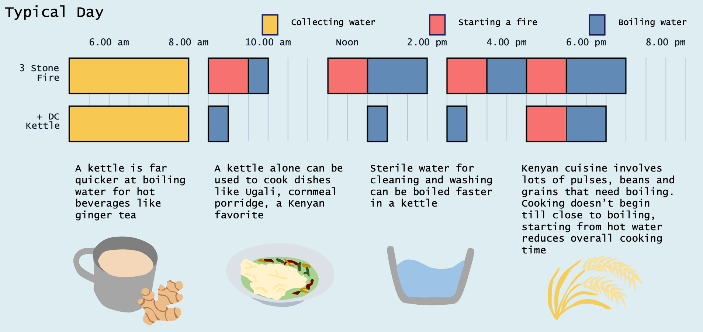
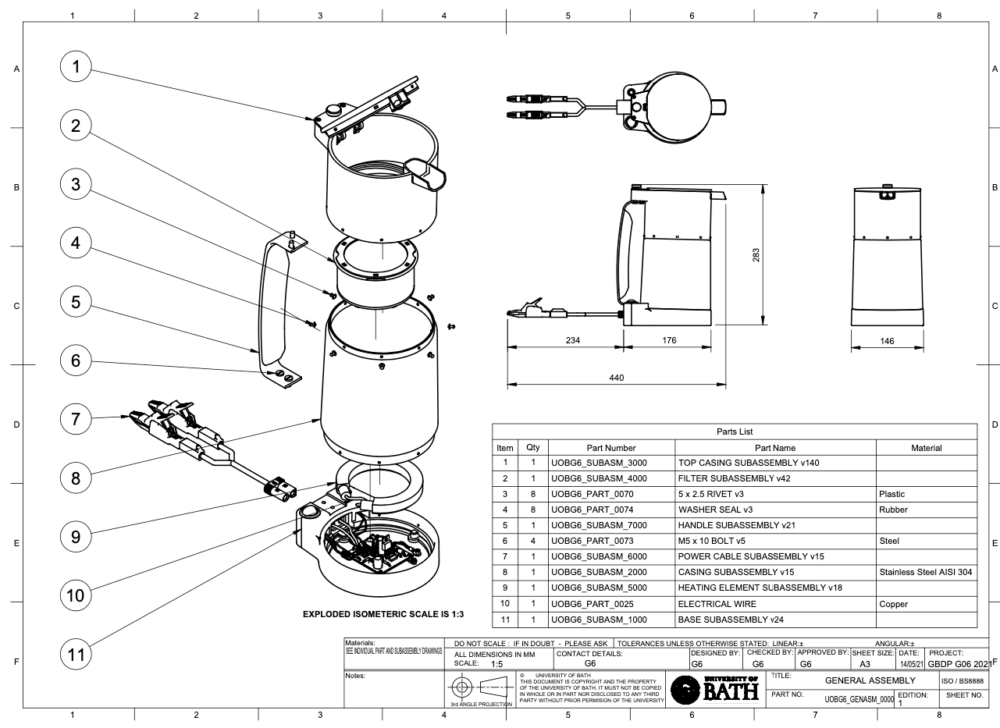
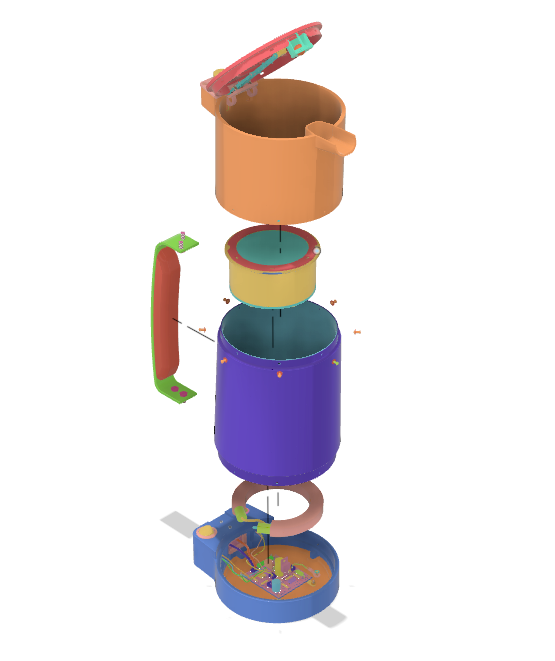

The UN SDG 7 identifies access to reliable, affordable, and modern energy as a critical step in eliminating poverty around the world. Access to energy is an enabler and central to achieving many of the other SDGs.

The most economical way of achieving electrification in remote and peri-urban settings is through DC mini-grids and solar home systems. With the turn of the decade, access to energy in developing regions is growing. The IEA forecasts more than 600 million people in Sub-Saharan Africa need to be served by an off-grid renewable solution by 2030 to meet SDG 7.

Conventional, inefficient appliances use far too much energy to be used affordably with off-grid solar home systems or mini-grids. The burden of inefficient appliances can overload these small systems causing load shedding and outages. More efficient, intentionally designed off-grid electrical appliances need to be designed to meet this energy demand; and that is what the Efficiency for Access design challenge sets out to achieve.

Our appliance provides a method of boiling water to Kenya, a DC vacuum insulated kettle with an integrated filter. The insulation minimises heat loss meaning the water will retain its heat for many hours and the kettle will not have to be re-boiled. This saves the user both time, and cost associated with energy use. The activated carbon and alumina filter removes contaminants that cannot be removed via boiling.

The project followed a user-driven development framework to make sure that we follow the challenge brief of providing valuable impact to people’s lives.

In the concept design stage, for example, sketches were used to generate ideas; a user study was also conducted to investigate potential benefits of the proposed reduced boil time. Volunteers were asked to follow a set of rules designed to best simulate the user experience of boiling water in rural Kenya.

Building on a house of quality analysis, user research, and talking to our group's mentor (who worked for a large off-grid appliance suppier in Kenya), a user profile was built up. This gave a representation for a typical day and use case of a kettle.

The user is most likely female and like most Kenyan women, they could spend at least 4 hours a day on unpaid domestic work, on top of weekly tasks such as collecting firewood. A kettle cannot eliminate all of this, like collecting water each day, but it can reduce domestic burden.

This information drove the design specification which was then used to produce detailed designs of for each subsystem of the kettle. DFMEAs, thermal modelling, electrical simulation, PCB layout design and material selection are all examples of embodiment of the detailed design.

