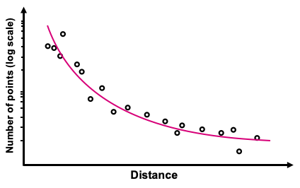
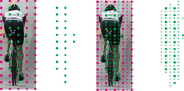
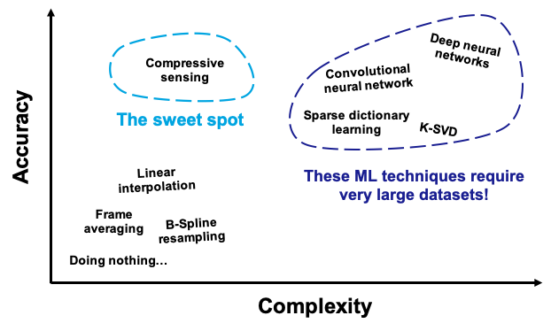
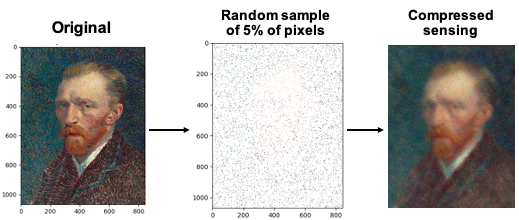
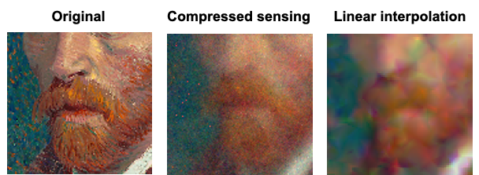

During my year-long industrial placement at TTP[^1] , I worked in the Sensors and Devices (SD) group alongside a multidisciplinary team of scientists and engineers.

[^1]: The Technology Partnership, https://ttp.com/

> TTP is an engineering and technology consultancy working across a variety of industries. In recent years TTP have become involved with a lot of work in the life sciences, especially diagnostic care but also work on anything from satellites to medical inhalers.

I was fortnuate enough to work on projects in many different fields as well as maturity of technology; some were early on in development, at the concept stage, others have been in production for many years.

My work in varied day to day but included software development, mechanical design and validation testing for multiple projects covering a wide spectrum of industries including LiDAR[^2] for autonomous driving, [low-cost gas sensing](https://www.ttp.com/news/sonicsense) and [rapid molecular flu diagnostics for primary care](https://lexdiagnostics.com/).

[^2]: **Li**ght **D**etection **A**nd **R**anging

Working on rapid flu testing and making software and hardware for lab use to develop a prototype diagnostic device was an experience that I allowed me to get hands on with lots of different aspects of design and experimental R&D.

I was involved in another project testing LiDAR sensor range, this involved measuring performance of a commercial automotive LiDAR sensor in different lighting conditions. The findings from this work as well as the desire to better understand sensors in the autonomous driving area lead to an internal student project in upsampling LiDAR data.

Autonomous driving requires lots of data from many different types of sensors. LiDAR is one of those types, all sensors have their advantages and disadvantages compared to each other. LiDAR happens to have a lower resolution than imaging using a camera for example.

A high level plan was drawn up so that I had a loose target to follow and organise my time accordingly, but it was by no means a strict development program. The actual project was fairly unbounded and driven by myself. The plan included regular meetings where I would update my colleagues and to use their expertise to guide me on where to go next with the project.

Prior to my placement, I had little experience with Python or algorithm development. This student project was a great way for me to learn quickly in a real world context but without the added pressure of deliverables for external clients.

I started with a market analysis, academic research and a literature review where I compared the many ways of upsampling data. After reading relevant academic papers, I selected a few promising techniques to take further. I made simple 1D demos to test the edge cases of a handful of techniques and get a feel for their relative performance to each other. Compressed sensing came out to be a perfect mix of good upsampling performance yet simple & cheap to compute.

I then took the concept further and developed a 3D demo from scratch for use with much larger point cloud data sets. I was a able to validate my work quantitatively against real-world LiDAR data to find vast improvement in performance compared to other ML techniques.

The MATLAB, maths and modelling techniques knowledge from university and the other Python data processing projects I did on placement helped me put together a demo of the working algorithm. This project ran in a similar format to design modules on my course at university, with lots of scope for research, validation testing and learning throughout the project; all while steering the outcomes and goals of the project myself as I went along.

This was one of many interesting projects that I was lucky enough to contribute too and I am glad that I was able to have this experience.
