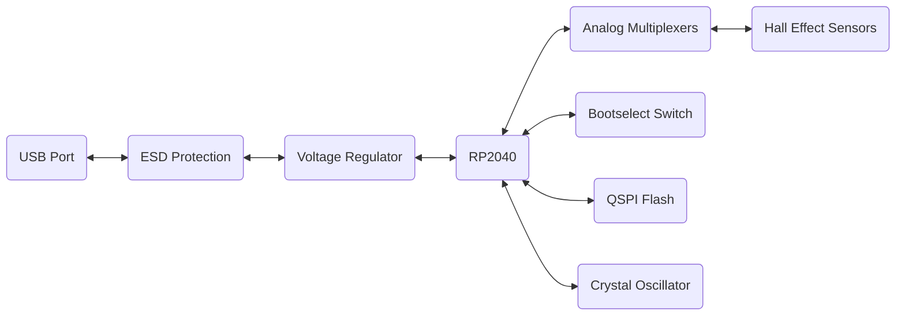
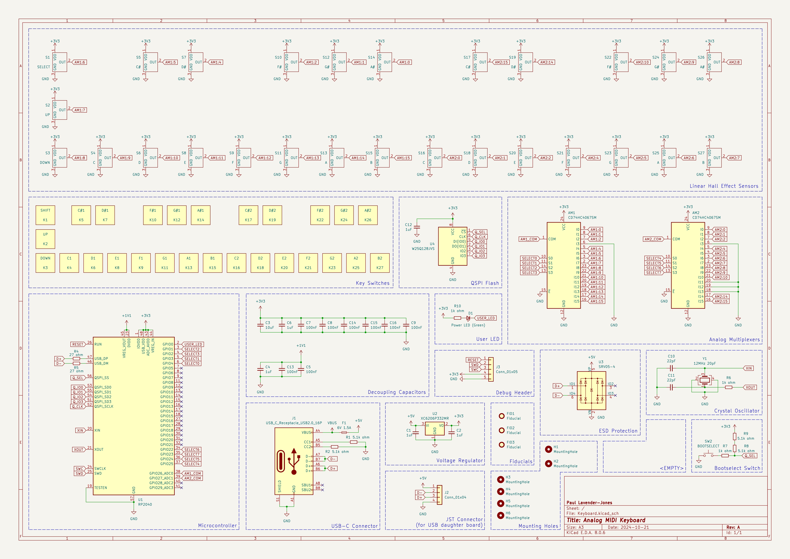
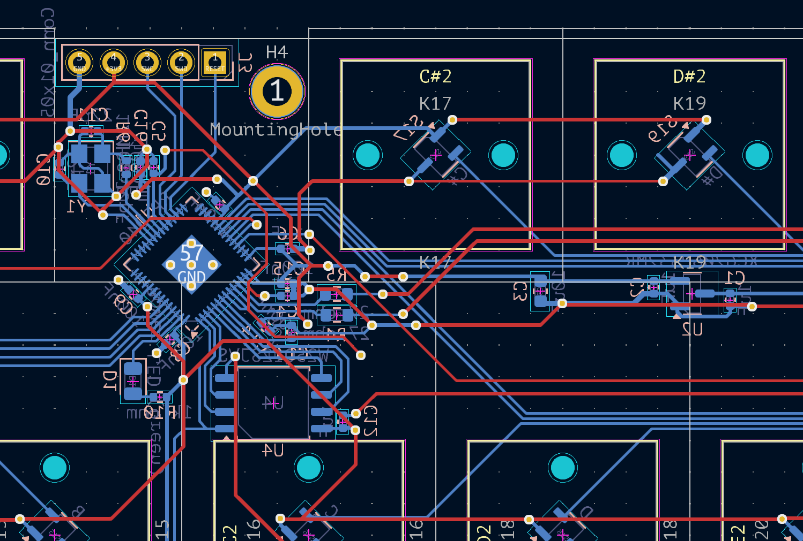
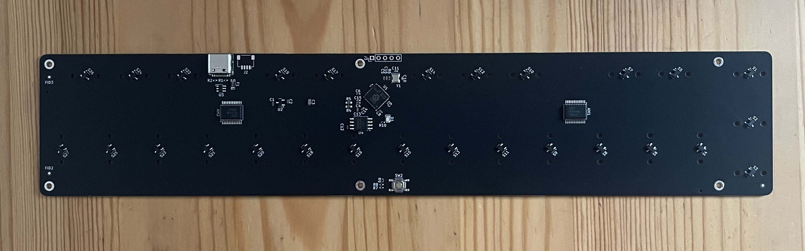

I've had an interest in electronic engineering for a while but have only dipped my toe into it in the past. I've been drawn to embedded development specifically because I find the interaction of physical and digital systems to be very rewarding to work on. There's something uniquely satisfying about writing firmware to blink an LED, compared to creating a web page with a button that changes color.

However, the real fun of running software on a microcontroller only comes when you want to do more than just blink an LED. As soon as I had the simple stuff working, I wanted to create more complex projects with my development board, like interfacing with buttons, sensors, or an LCD screen. My ideas for fun projects quickly outgrew the capabilities of the hardware I had, and I soon found myself wanting to create something more polished and closer to a product I would buy.

## What Do I Want To Make?

The project I wanted to create is fairly simple: a small MIDI keyboard to control software synthesizers in Ableton. While there are plenty of these available to buy, I specifically wanted to make a relatively cheap, minimal keyboard with velocity-sensitive keys and physical buttons you can press (bonus points for looking good). Most of the existing keyboards I found were either too expensive[^expensive], too large[^large], overkill[^overkill] for my needs, or didn't have the features[^basic] I wanted.

[^expensive]: The [ROLI Piano M](https://roli.com/uk/product/piano-m-create) is beautiful and simple but is expensive for what it is.

[^large]: The [Arturia Microlab](https://www.arturia.com/products/hybrid-synths/microlab/overview) is small and looks great but I feel like it can be slightly cheaper and more compact.

[^overkill]: The [ROLI Seaboard M](https://roli.com/uk/product/seaboard-m) is a beautiful and innovative keyboard, but again, expensive as well as having more features than I need.

[^basic]: The [Korg nanoKEY2](https://www.korg.com/uk/products/computergear/nanokey2/) is small and cheap but (if I am being nitpicky) it doesn't have satisfying keys to press.

I'm sure if I looked long enough I could find something that meets my arbitrary requirements. So to be honest, this is just an opportunity/excuse to learn how to design a PCB.

I have no previous experience in designing PCBs but luckily, like most things, there is no shortage of resources to learn from online. For example, there is a fairly large community of mechanical keyboard enthusiasts, many of which have shared how they have designed and manufactured custom keyboards. Fortunately for me, there is a lot of overlap in designing a keyboard for typing and one for making music. Another benefit is the large selection of standard components available for keyboards, such as key switches, and key caps.

While researching mechanical keyboards, I came across a [keyboard](https://wooting.io/wooting-60he) from Wooting that caught my eye. Unlike a traditional keyboard where the key press is registered by a mechanical switch, the Wooting keyboard uses hall effect sensors to detect the position of each key. Normal keys on a keyboard are either pressed or not, having only two states, but hall effect switches have magnets in them can be read by a hall effect sensor at any point in the actuation, making each key an analog input. Although most of the features the Wooting keyboard advertises are geared towards gaming, this analog input is what caught my eye, since it could be used to either fake or calculate velocity per key. Wooting even have [an example](https://github.com/WootingKb/wooting-analog-midi) of how to use the analog input to send MIDI messages to a computer.

I've previously played around with a Raspberry Pi Pico, and found it has a large community making it easy to learn and develop on. The Pico uses Raspberry Pi's RP2040 microcontroller, which has great Rust support and tooling so I decided to design my PCB around the RP2040 and use the Wooting keyboard as inspiration for the hall effect key switches.

## (Back) To The Drawing Board

I read and watched a bunch of youtube videos[^learning-design] on the basics of designing a PCB, and the general process seems to be; create a schematic, select and layout the components, get it made, and then write the firmware. I'll go through each of these steps in more detail in the sections below. I used [KiCad](https://www.kicad.org/), an open-source electronics design automation (EDA) tool, to create my schematic and layout. KiCad is powerful and a shocking good[^kicad] free software thats commonly used by hobbyists, so again plenty of tutorials online to help me out.

[^learning-design]: Phil's Lab is a great youtube channel for learning about electronics and PCB design. [This video](https://www.youtube.com/watch?v=aODkA2mrimQ) explains how to start learning and good resources to use. [This other video](https://www.youtube.com/watch?v=aVUqaB0IMh4) is also useful as a reference for the general process of designing a PCB with a microcontroller.

[^kicad]: I say shocking because a lot of the free CAD software I have used in the past have been pretty bad or basic

### What Connects To What?

The first step in designing a PCB is to create a schematic, which is a visual representation of the components and how they are connected. Think of it as a flow chart for your PCB, it describes what each component is electrically and how they are connected to each other but not where they are physically placed. I used [two](https://www.youtube.com/watch?v=6Z49bynRqj8) [designs](https://www.youtube.com/watch?v=TfKz_FbZWLQ) as references for this, and took elements from both to create my own.

At a very high level, the schematic for my PCB looks a bit like the diagram below. The USB port is where the PCB will get power and communicate with the computer. Eventually the power gets regulated and fed into the RP2040, which is the microcontroller that will run the firmware. The RP2040 will be connected to the hall effect sensors, via some analog multiplexers. The RP2040 also requires a bootselect switch, a QSPI flash, and a crystal oscillator to function correctly.



There are also a bunch of other passive components like resistors and capacitors that are required for the circuit to function correctly, as well as a debug LED. I won't go into detail about these components, but they are all included in the full schematic which you can see below.



It makes sense to talk about schematics before layout, but in reality it required a bit of back and forth between the two. I started by creating a rough schematic of the components I wanted to use, and then started to layout the components on the PCB. As I was laying out the components, I realised that the schematic was missing some components, or that I had too many components, so I would go back and forth between the two until I was happy with both.

### Laying It All Out

Now that we know what components we need and how they are connected, we can start to layout the components on the PCB. The layout is the physical representation of the PCB, it describes where each component is placed and how they are connected to each other. The layout is important because it can affect the performance of the circuit, for example, the length of the traces can affect the resistance and capacitance of the circuit, and the placement of components can affect electromagnetic interference.

EDA tools like KiCad are great for this, they make it hard to go wrong, and have large component libraries which have lots of common components and their footprints already defined. The layout is a bit like a puzzle, you need to fit all the components on the PCB, and connect them together without any traces overlapping or crossing over each other.



Your final design needs to be manufacturable, and KiCad makes this a breeze to do. This stage is also where you can start to really visualise what the final product will look like which I found quite fun. Its satisfying iterating and packing the components together like a puzzle. Once you have a rhythm going, and a bit of a structured process it doesn't take too long to get a layout you are happy with.

:::note
You can find the KiCad project files of the schematic and layout for my PCB on [GitHub](https://github.com/paullj/synth/tree/main/synth-hardware)
:::

## Off To The Factory

Now that I had a first attempt at designing a PCB, I needed to get it manufactured. Its all well and good having a design, and triple checking that the circuit checking tool in KiCad is happy with my input but I can't easily make a PCB at home, so I needed to send my design out to a PCB manufacturer. There are a lot of PCB manufacturers out there, and they all have different capabilities and prices. I used [JLCPCB](https://jlcpcb.com/) because they are cheap and have a pretty good reputation, but there are plenty of other options out there.

JLCPCB have an online parts library that you can browse, once I knew I was going to use them I made sure to only use components that they had in their library. Again this required a bit of back and forth between the schematic and layout, as I had to make sure that the components I was using were in the library, and that the footprints matched the components I had chosen. But it was a fairly painless process, and I was able to find all the components I needed.

I exported the necessary files and uploaded them on an online form where I filled out some additional details that can't be inferred from the files. I chose pretty much the default options for everything with the minimum order quantities, and a few days later I had a confirmation that my PCBs were being manufactured. I also opted for the assembly service, which means that JLCPCB will solder the components onto the PCB for me. This is a bit more expensive, but I had a lot of tiny SMD components that I could not be bothered to solder myself. The delivery, manufacture of 5, and assembly of 2 PCBs cost around £45, which I think is pretty good value (especially considering around half of that was shipping).

After 2 days all the manufacturing and assembly was done, and I had recieved a shipping tracking number. Within a week of ordering my PCBs, they had arrived at my door. I was very impressed with the quality of the PCBs, and the assembly was perfect. I was a bit worried that I had made a mistake in the design, but visually everything looked good. I was very happy with JLCPCB, and I would definitely use them again.



## Hello World (or equivalent)

I plugged in my board with a USB-C cable and sure enough the LED on the board turned on! The board even appeared as a mass storage device on my computer meaning the RP2040 and flash were at least powering on correctly. I was very happy that I had managed to get this far, with no experience and no hiccups (it was honestly quite surprising).

The next thing to do was to write a bit of firmware to test that the RP2040 was actually functioning correctly and I could deploy code to it. I used [Rust](https://www.rust-lang.org/) to write the firmware, as I had used it before and I think its a great language for embedded development. I also wanted to try the [embassy](https://www.embassy.dev/) framework, which is a high-level framework for embedded development in Rust. I spun up the classic hello world equivalent of embedded development, a blinking LED.

The firmware is only 30 lines long and is in its entirety below.

```rust
// src/main.rs
#![no_std]
#![no_main]
#![feature(type_alias_impl_trait)]

use defmt_rtt as _;
use embassy_executor::Spawner;
use embassy_rp::gpio::{Level, Output};

use embassy_time::{Duration, Timer};
use panic_probe as _;

#[embassy_executor::main]
async fn main(_spawner: Spawner) {
    defmt::info!("Initializing...");

    let peripherals = embassy_rp::init(Default::default());
    let mut led = Output::new(peripherals.PIN_0, Level::Low);

    defmt::info!("Initialized.");

    loop {
        defmt::info!("My LED on!");
        led.set_high();
        Timer::after(Duration::from_millis(500)).await;

        defmt::info!("My LED off!");
        led.set_low();
        Timer::after(Duration::from_millis(1000)).await;
    }
}
```

After a bit of trial and error with the GPIO pin number and toolchain commands, I was able to compile and deploy the firmware to the RP2040. The LED on the board started blinking as expected.

import blinky from "./blinky.webm";

<video autoplay loop controls src={blinky} type="video/webm" />

I would call this a success, I had designed and manufactured a PCB from scratch, and written some firmware to run on it. I had learned a lot about electronics, PCB design, and embedded development in the process. Of course there still a lot to do before I have a working MIDI keyboard, but I am happy with the progress I have made so far.

## Next Steps

Now that I can say that my board is not totally broken (although the hall effect sensor circuit is still untested), I can start to work on the firmware that will read the hall effect sensors and send MIDI messages to the computer. I have a rough idea of how I want to do this, but I'll need to do some experimentation to get it working. I'll also need to design a case for the PCB and a mounting plate for switches, but this is a bit further down the line and something I am much more comfortable doing.

I'll write a follow up post when I have made more progress, but let me know if you have any questions or suggestions below in the meantime.
