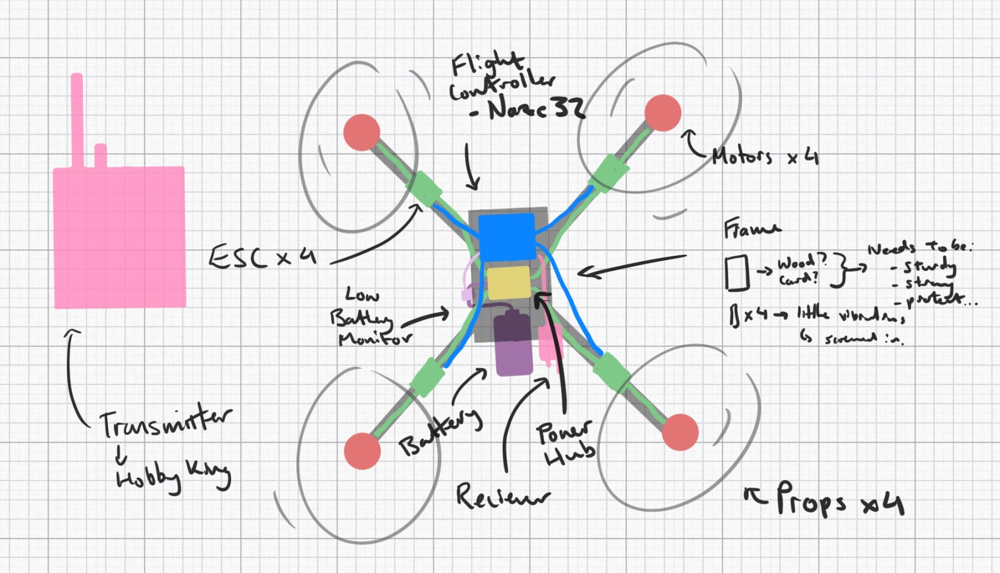
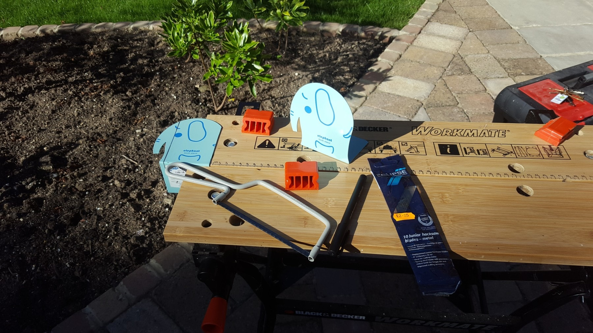
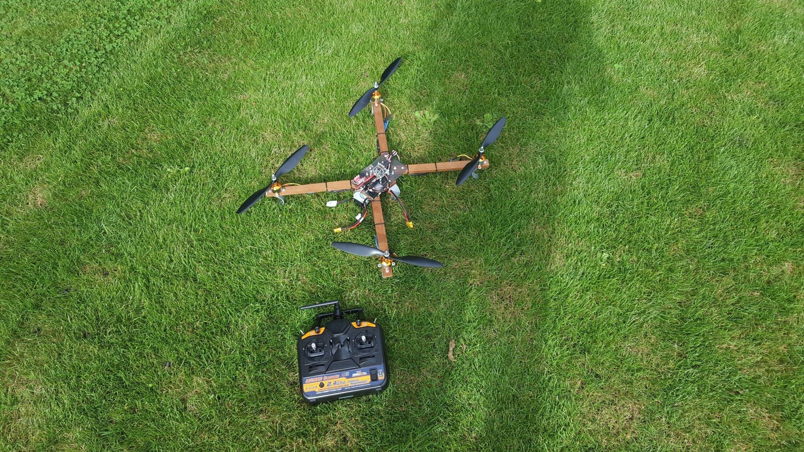

I designed a drone with a frame made with recycled and reused materials from old stuff I found lying around the house. This meant I could build it relatively cheaply and more sustainably compared to a commercially available quadcopter. A rough plan and design was drawn up so that the relevant parts could be sourced.

The sturdy frame comprised of a polycarbonate laptop cover, a mahogany shelf, a steel bookend and a PVC pipe. The laptop cover made up the main base of the quadcopter, where the recycled shelf arms were attached. The controller and power distribution boards are mounted onto the base where the ECSs can connect to from each arm. The steel bookend was made into a holder for the LiPo battery and attached to the underside of the quadcopter.

Using recycled materials also meant that the frame was on the heavier side and so I had to use light, powerful but cheap motors along with 10 inch propellers for maximum lift.

